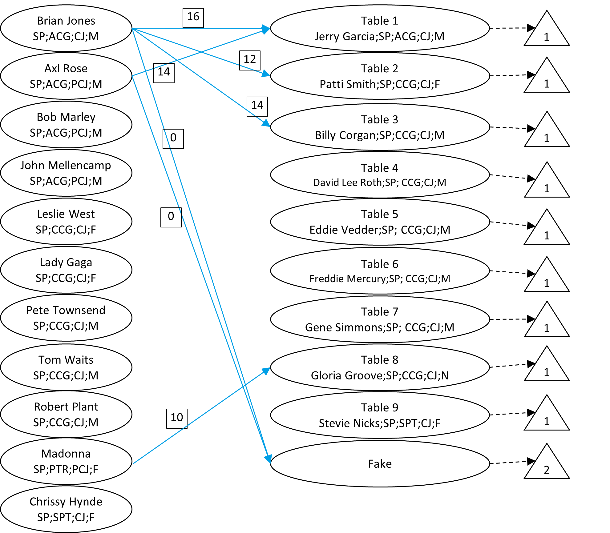
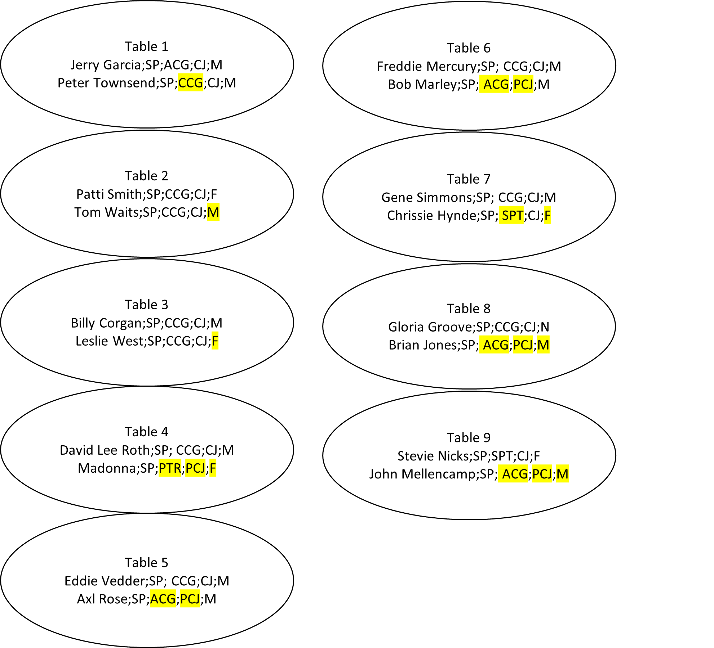

# Optimization of Table Arrangements to Maximize Diversity
This algorithm, fully described below, assigns attendees to tables to maximize the differences between the attendees.

## Inputs

There are two inputs:
- The list of attendees and their attributes
- A configuration file used to select the attributes to use, and parameters for fine-tuning the objectives

### List of attendees

In the folder 'data_and_log_files' is a sample list of attendees who are employees of a company.  It is a comma separated file and the first few rows look like:

```
ID,Name,Office,Role,Start_Class,Gender
1,Madonna,Sao Paulo,PTR,PRE_COVID_JOINER,F
2,Patti Smith,Sao Paulo,CCG,COVID_JOINER,F
3,Grace Slick,Atlanta,SPC,PRE_COVID_JOINER,F
4,Tina Turner,Atlanta,SPC,PRE_COVID_JOINER,F
5,Janis Joplin,Atlanta,SPC,PRE_COVID_JOINER,F
```

The first two columns identify the attendee, and usually the **ID** field is a unique identifier.  The **Name** field does not have to be unique.

The next columns are attributes.  In this example:
- **Office**: the office where the employee works
- **Role**: The title of the employee (PTR - Partner, SPC - Specialist, etc.)
- **Start_Class**: An indicator of when the employee started.  Here we only differentiated by joining before COVID or during/after COVID
- **Gender**: Gender of the employee, currently using F, M, N, where N refers to non-binary or 'other'.

**Important to note:  You do not need to use any of these field names.  The configuration file is used for specifying which columns should be used for the ID, Name and any attribute**

### Configuration file

The configuration file uses standard YAML syntax and is divided into various sections.

The first section is the size of the tables (number of attendee).  The number of tables that will be use is $ceil(n/s)$ where $n$ is the number of attendees and $s$ is the `max_group_size`.  The $ceil()$ function (called the *ceiling* function) is essentially the 'round up' function

```yaml
# number of tables is implicit
max_group_size:                    8
```

The next section is where the input (list of attendees and configuration file) and outputs (log file, attendee assignments and table summary statistics) will be located

```yaml

# location of directories and files
data_directory:                    path_to\data_and_log_files
```

The list of attendees can have any file name but should have a `.csv` extension.  You can also call the three output anything, although it is recommended that the log file have a `.txt` or similar extension to denote a text file, and the two output files should have a `.csv` extension so that they could be opened/viewed in Excel.

```yaml

# names of files in the data_directory
## input
attendee_file_name:                attendees.csv

## output files
log_file_name:                     log.txt
table_assignments_file_name:       table_assignments.csv
table_summary_statistics:          table_summary.csv
```

You will need to specify the name of the ID field (and the ID field could be numeric or text, but it should be different for each attendee).

We are also expecting a field that has the attendee's name.  Note that the algorithm does not do anything with these fields except to report them in the final table assignments.

The attributes of each attendee is that listed as a comma-separated list enclosed by square brackets.  That format is important.  There could be other fields in the list of attendees, but only the fields used in the `attribute_field_names` will be used by the algorithm.

The algorithm will be treating the data as text, not numbers.  If the `Start_Class` field in the data has, say, the year the attendee started at the company, this will be treated as text.  In trying to keep diversitry, if three attendees had start years of 2005, 2018 and 2019, the default behavior of the algorithm is to treat all three attendees as having different start years, and not treat, say, attendees whose start years are one-year apart differently than attendees whose start years are 13 years apart.

```yaml

# Fields
id_field_name:                     ID
name_field_name:                   Name
attribute_field_names:             [Office,Role,Start_Class,Gender]
```

To understand how the algorithm measures diversity, let's begin with a simple example.  In the sample file, 31 out of the 67 have the role of SPC.  The number of tables, based on a maximum table size of 8, is $ceil(67/8)=9$.  So we would want no more than $ceil(31/9)=4$ attendees with role of SPC at any table.

We give the number of attendees at a table a *score* that is the square of the number of attendees whose role is SPC.  The concept of using the square is that the algorithm would prefer two tables with, say, 3 SPC and 4 SPC respectively to, say, 2 SPC and 5 SPC.  The reason is that $3^2+4^2=25$ is smaller than $2^2+5^2=29$.  

The `default_quadratice_penalty` is a multiplier to the square of the number of attendees with a specific attribute.  You can override this penalty to put more (or less) weight by a given attribute.  In the below, we multiply by 2 the square of the number of SPC since that is a type of role.

This form of quadratic penalty is most important of the two

There is also another mechanism for measure diversity.  It is a score for having diversity by examining how many combinations at the table that have the same type of attribute.  Typically this is set to 0.  Suppose it was set to 2, and there are 3 attendees at a table with ID's of A, B and C and respective roles of PTR, SPC and SPC.  For the three combinations of attendees (A/PTR,B/SPC),(A/PTR,C/SPC),(B/SPC,C/SPC), there would be a score of 0, 0 and 2 for a total of 2.  The idea is to penalize tables that have similar attendees.

Typically, the default_sameness_score is 0, because the quadratic penalty is often 'good enough' to bring in diversity.

However, sometimes fine-tuning the objective is important.  In this case, we note that the 7 attendees from the Princeton office have no partners.  So it was important to try to sit those attendees at tables that have partners.  So we give a 'reward' (negative -1 in this case) to tables with attendees that have the role of PTR and also have tables of attendees from the Princeton office.

```yaml
# Score parameters
default_quadratic_penalty:         1
override_quadratic_penalty:        {Role: 2}

default_sameness_score:            0

# Princeton has only 3 attendees, all SPC and no partners
#   So want to try to have the Princeton attendees sit with a partner
# format for overrides is a list of:  [attribute_name_1, specific attribute, attribute_name_2, specific attribute, override score]
override_sameness_score:          [[Role,PTR,Office,Princeton,-1]]
```

If no override is needed, use:
```yaml
override_sameness_score:          []
```

Let's work through an example

Suppose a table is assigned to the following attendees:

```
           NAME     Office Role       Start_Class Gender
    Tina Turner    Atlanta  SPC  PRE_COVID_JOINER      F
Paul Westerberg  Princeton  SPC  PRE_COVID_JOINER      M
John Mellencamp  Sao Paulo  ACG  PRE_COVID_JOINER      M
  Stevie Wonder   Montreal  CCG      COVID_JOINER      M
   Van Morrison    Atlanta  SPC  PRE_COVID_JOINER      M
     Diana Ross    Atlanta  SPT  PRE_COVID_JOINER      F
   Robert Plant  Sao Paulo  CCG      COVID_JOINER      M
         Eminen     London  PTR  PRE_COVID_JOINER      M
```
We calculate the quadratic scores as given below.  Note that the score for the Role attribute is two times the square based on the `override_quadratic_penalty` parameter.

```
Attribute   Item              Count  Score
Office      Atlanta           3       9
Office      Princeton         1       1
Office      Sao Paulo         2       4
Office      Montreal          1       1
Office      London            1       1
Role        SPC               3      18
Role        ACG               1       2
Role        CCG               2       8
Role        SPT               1       2
Role        PTR               1       2
Start_Class PRE_COVID_JOINER  6      36
Start_Class COVID_JOINER      2       4
Gender      F                 2       4
Gender      M                 6      36
```

This adds up to 128.  However, we note that there is one attendee from the Princeton office and one partner, which adds a -1 to the score for a final score of 127.

The last parameter sets a maximum time and maximum iterations.  More about how to stop the algorithm in the section of "How to run".

```yaml
# Technical parameters
max_run_time_seconds:              300
max_iterations:                    500
```

## How to run the model

The model could be run on the command line as

```python
python run.py --config_location path_to_config.yml
```

There are four ways to have the model stop running - in all cases at least an initial solution will be found
1.  Reach the `max_run_time_seconds`
1.  Reach the `max_iterations` limit
1.  Press 'ctrl-c' while the model is running.  It will complete the current iteration, and then stop, outputting the best solution found
1.  When the `default_sameness_score` is 0, and there is no `override_sameness_score`, then the model can detect optimality and will stop by itself
  * In this case, optimality is when every specific attribute is spreadout as much as possible.


## Interpreting the output

The **log file** shows the intermediate solutions and running of the algorithm.  It will not be discussed in more detail.

The **table assignment** output looks like the below, and should be reasonably clear.  Columns are:

1.  Table number that is assigned to the attendee
1.  The ID field (from the parameter `id_field_name`) of the attendee
1.  The Name field
1.  Columns 4+ are the attributes of the attendee
```
Table,ID,NAME,Office,Role,Start_Class,Gender
1,65,Sam Smith,Atlanta,SPC,PRE_COVID_JOINER,N
1,34,Freddie Mercury,Sao Paulo,CCG,COVID_JOINER,M
1,35,David Grohl,Montreal,CCG,COVID_JOINER,M
1,66,Joni Mitchell,Princeton,SPC,PRE_COVID_JOINER,F
1,10,Ann Wilson,Atlanta,SPT,PRE_COVID_JOINER,F
1,18,Jerry Garcia,Sao Paulo,ACG,COVID_JOINER,M
1,19,Liam Gallagher,Atlanta,SPC,PRE_COVID_JOINER,M
```

The **table summary** shows a one-line summary for each table.  The columns are:
1.  Table is the table number
1.  Score is the total score (both the quadratic penalty and the 'sameness' penalty)
1.  Penalty is the number of attribute items that are over represented.  For example, we have mentioned in the small example that there are 31 SPC roles for 67 attendees and 9 tables, leading wanting either 3 or 4, but not more than 4, SPC at a table.  If a table has 5 SPC roles, then that is consider a violation.  The Penalty is the number of violations.  Ideally it should be 0 at the end.
1.  Table_Size is the number of attendees assigned to that table
1.  The remainder of the columns show the number of attendees with the specific attribute.  It is ideal if for each specific attribute the number of attendees for each table are within 1 of each other.

```
Table,Score,Penalty,Table_Size,Atlanta,London,Montreal,Princeton,Sao Paulo,ACG,CCG,PTR,SPC,SPT,COVID_JOINER,PRE_COVID_JOINER,F,M,N
1,99.0,0,7,3,1,1,0,2,1,2,0,3,1,3,4,2,5,0
2,127.0,0,8,3,0,1,1,3,0,2,1,4,1,3,5,2,5,1
3,98.0,0,7,2,1,1,1,2,1,2,1,3,0,2,5,2,5,0
4,103.0,0,7,3,0,1,1,2,1,2,0,3,1,2,5,2,5,0
5,103.0,0,7,3,0,1,1,2,1,2,0,4,0,3,4,2,4,1
6,128.0,0,8,3,1,1,0,3,1,2,1,4,0,3,5,2,5,1
7,123.0,0,8,3,1,1,1,2,1,1,1,4,1,3,5,3,5,0
8,115.0,0,8,3,1,1,1,2,1,2,1,3,1,3,5,3,5,0
9,103.0,0,7,3,0,1,1,2,1,2,0,3,1,2,5,2,5,0
```

## How it works

This section goes through the underlying logic, and discusses some of the math, as well as the differences between this work and other published work.

### Overview of the problem

The literature sometimes calls this the "Maximally Diverse Grouping Problem".  See, for example, https://www.sciencedirect.com/science/article/pii/S0377221716303381

The general setup is that we have $m$ attendees $A={1,2, ... ,m}$ and $n$ tables $T={1,2,...,n}$.  Let the binary variable $x_{a,t} \in {0,1}$ with $a \in A$, $t \in T$ represent an assignment of an attendee to a table.  This means $x_{a,t}=1$ if attendee $a$ is assigned to table $t$ and $x_{a,t}=0$ otherwise.

We assign every attendee using the constraint

$$\sum_{t \in T} x_{a,t}=1,  \forall{a \in A}$$

Letting $s$ be the maximize table size, the number of tables we need is $n=\lceil m/s \rceil = ceil(m/s)$.  We need to assign at most $s$ attendees to each of the $n$ tables:

$$\sum_{a \in A} x_{a,t}<=s, \forall{t \in T}$$

Finally, the objective function found in the literature is usually written as a *quadratic assignment problem*:

$$\max \sum_{t \in T}\sum_{a_1 \in A}\sum_{a_2 \in A} d_{a_1,a_2}x_{a_1,t}x_{a_2,t}$$

To understand this, note that $x_{a_1,t}x_{a_2,t}=1$ only when attendees $a_1$ and $a_2$ both are assigned to table $t$.  The coefficient $d_{a_1,a_2}$ represents a diversity score and should be high when attendees $a_1$ and $a_2$ are not similar and low when they are similar.

This quadratic objective function automatically makes this problem very hard to solve (so called $NP$-complete).

Our two-part objective function follows this form, although we never need to explicitly derive the coefficients $d_{a_1,a_2}$

### Solution approach

We solve this in two steps
1.  Choose a single attribute type -- one that has many attribute items -- and evenly distribute them out one-seat per table at a time.
1.  Randomly choose for each table an attendee, remove that attendee, then reassign the attendees to the tables to minimize a penalty function

The central task in both of these steps is to assign attendees to a single seat at each table.  This is done by using a network flow algorithm.  Network flow algorithms are readily available in a number of programming languages and run very quickly.

Let's explain by using our example data.  Recall that the example had 67 attendees, with a max table size of 8 implying we need to populate 9 tables, of which 4 will have 8 people and 5 will have 7 people.  We will focus on assigning the 20 Sao Paulo attendees to the 9 tables.  Suppose that we already assigned one Sao Paulo attendee to each table, leaving 11 Sao Paulo attendees to further assign.

To assign the next set of 9 Sao Paulo attendees to the tables, we setup a network flow model as diagrammed below.  On the LHS we see the details of the 11 Sao Paulo employees not assigned yet, on the RHS are the 9 Sao Paulo employees already assigned (one to each table) as well as a 'fake' node to represent the Sao Paulo attendees who will not be assigned in this task.

The triangles are the 'demands' for the 'Table' and 'Fake' nodes  The supplies from the LHS attendees are always 1 and not shown in the diagram.

There are 11 x 10 = 110 arcs, but only a few of them are shown.  There is one arc from every LHS node to every RHS node.

The boxes on these arcs present the penalty score if that attendee is assigned to that table.  If Brian Jones is assigned to Table 1 where Jerry Garcia is currently assigned, there is a score of 16 because there would be 2 Sao Paulo attendees, 2 ACG's, 2 Covid Joiners and 2 males at the table ($16 = 2^2+2^2+2^2+2^2$).  If Madonna is assigned to Table 8 with Gloria Groove, the only attribute overlap is that they are both from the Sao Paulo office.  But the other three attributes are different (6 attributes only occur once) leading to the score of 10.

There is no cost to go to the fake node.



The 'network flow algorithm' is used to optimally assign 9 of the 11 remaining Sao Paulo attendees, one assigned per table.

**Because we are only assigning one attendee per table, we can evaluate the quadratic objective function easily, and still use a linear optimization method**.  This is because we can pre-determine the objective at each table for each possible attendee.  This is not true if we wanted to assign two people to each table in a single pass.

The solution is illustrated below and shows the assignments, the first row in each bubble was the original attendee and the second row is the newly assigned attendee.



The second row has highlights to show what was different from the first row. Note that three tables had a second assignment with one attribute difference, three had two attribute differences, and three had three attribute differences. This indicates that the network flow algorithm did try to diversify the tables.

The algorithm in more detail is:

**Step 1:**
a.  Find the attribute type that has the most number of unique items.  In our example, both Role and Office have five different items, so either would be used.  In the below, we will use *Office* as the starting attribute.
b.  Take an item (in the case, *Sao Paulo*) from the starting attribute.  There are 20 attendees from Sao Paulo.  Make 3 passes using the network flow formulation shown above.
  - The first pass has 20 LHS nodes (one for each attendee) and 9 RHS table nodes and a RHS 'fake' node. The objective function is trivial because all the tables are empty, and the assignments that are made are essentially random.
  - The second pass is to assign the remaining 9 of the 11 remaining attendees to the 9 tables - exactly as we showed.
  - The third pass to assign the remaining 2 attendees to one of the 9 tables is slightly different.  Here the LHS has 2 nodes for the attendees and a 'fake' node with supply of 7.  The RHS has 9 table nodes.  The network flow optimization will pick the two tables that provide the most diversity when the attendees are added.
  c.  After Sao Paulo is fully assigned, another office location is picked.  Let's say Atlanta that has 26 attendees.  We first use the network flow model to assign 7 of them to the 7 tables that only have 2 attendees so that after that, all 9 tables have 3 attendees
  d.  Continue until all attendees are assigned

  **Step 2:**
  Randomly choose one attendee from each table, then use the network flow algorithm to reassign these attendees to the tables.  No need for a 'fake' node
